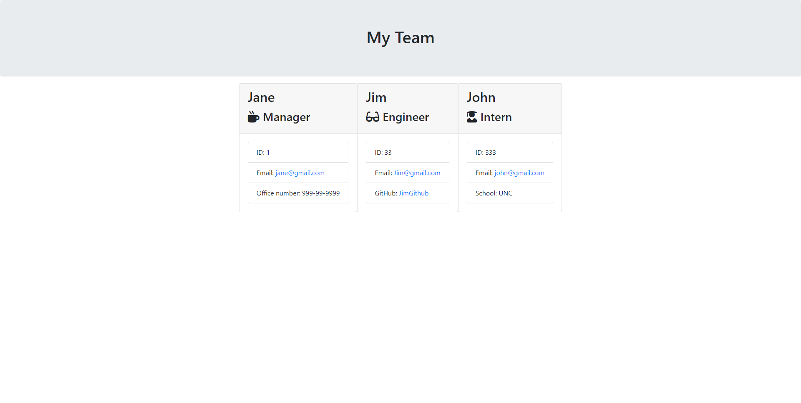

# Team-Creater-with-Node---Jest
(URL link goes here)
This is a team page creator
## Table of contents
* [General info](#general-info)
* [Technologies](#technologies)
* [Install](#install)
* [Test](#test)

## General info
This is a team page creator using Node.js and Jest for testing. The types of employees are Maanger, Engineer, and Intern. A HTML page is rendered in the outputs folder that displays the team members name, id, email, GitHub for engineers, school for interns, and office phone number for managers.  
	
## Technologies
Project is created with:
* Javascript
* Node.js, Inquirer
* Jest

## Install
Download the repository. Make sure you have node.js installed. Open your terminal and run
``` npm install ```
And then to run the application
``` node app.js ```
After running the appllicaiton, your document will be saved as Team.html in the 'output' folder.

## Test 
To run tests
``` npm run test```


